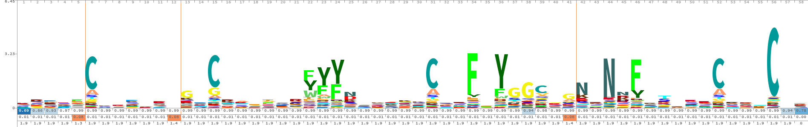

## Kunitz_domain_HMM
This repository contains the supplementary material and data associated with the work conducted for the building and testing of a profile Hidden Markov Model for annotation of Kunitz proteins.

### Datasets
Complete datasets of positive and negative proteins used for validation of the model could not be uploaded here due to them being too heavy for GitHub, text files containing the ids of the Uniprot entries are provided instead.

### Software used
All the commands have been executed in a Conda enviroment (Anaconda 24.9.2)

Python:
* python      3.12.9
* biopython   1.78
* requests    2.32.3
* pip         25.0

GNU-Core Utils:
* AWK         5.2.1
* sed         4.9
* comm        0.2.2

Hmmer:
* hmmer       3.3.2

Cd-hit:
* cd-hit      4.8.1

### Table of Contents
- [detailed commands](./detailed_command_list.md)
- [PDB custom report](./rcsb_pdb_custom_report_20250503062943.csv)
- [performance script output file](./definitive_merged_performance.txt)
- [python script for obtaining sequences](./get_sequence.py)
- [uniprot cross reference python script](./get_uniprot2.py)
- [performance python script](./performance.py)
- [sequence remover python script](./sequence_remover.py)
- [dataset of negative ids](./negative_proteins_ids.txt)
- [dataset of positive ids](./positive_proteins_ids.txt)

More information about the python scripts can be found in the `detailed_command_list.md` file and in the script docstrings.
